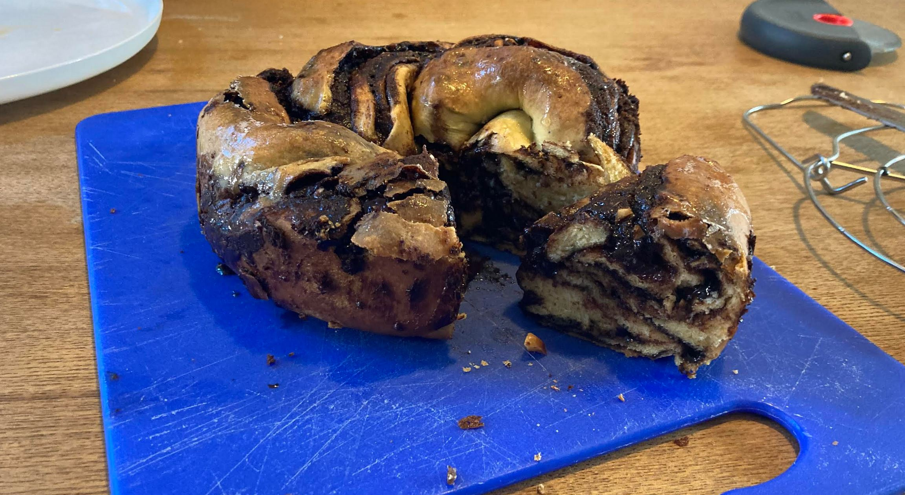

# Babka

## Source
Stolen from [british bakeoff](https://thegreatbritishbakeoff.co.uk/recipes/all/paul-hollywood-chocolate-babka/)

## Details
Makes: One delicious babka loaf (large)\
Prep Time:  45 min\
Rise time:  2 hours\
Cook Time:  45 min

## Ingredients

### Filling
- 65g blanched hazelnuts
- 100g unsalted butter
- 150g caster sugar
- 80g dark choc (70%)
- 40g cocoa powder

### Dough
- 275g flour
- 5g dried yeast
- 25g caster sugar
- 0.5tsp salt
- 2 beaten eggs
- 50ml milk
- 80g cubed and softened unsalted butter

## Method
1. Choose a dish to cook the babka. You need something with sides. Shape doesn't matter.
1. Oven to 200C
1. Butter, sugar, chocolate in pan, melt *very* slowly. Stir often. Once smooth and combined, mix in cocoa and leave to cool. Meanwhile prep hazelnuts and dough as below.
1. Roast hazelnuts for 4 min
1. Roughly chop hazlenuts after cool enough to handle
1. Flour in bowl. Yeast in on one side, sugar and salt in on the other.
1. Well up and add milk and eggs. Mix or knead with your plebian hands until firm.
1. Add butter gradually while mixing/kneading.
1. Knead until smooth and shiny.
1. Roll dough 40 by 30 cm
1. Cooled chocolate filling goes on top (leave a 1cm dmz on the outside). Hazlenuts scattered on top of chocolate.
1. Slice in half parallel to long edge. You will have two 15cm by 40cm rectangles now.
1. With each rectangle, enclose the chocolate by pressing together the long edges, forming a rough cylinder. Seal each end by pressing together.
1. With the chosen baking dish in mind, plait the two rolls. Try to fit as many turns in as possible, your base instinct will be to plait insufficiently often. Get into dish. Make it look as nice as possible!
1. Rise for 2h
1. Bake for 15min at 190C then 25-30min at 170C
1. Cool on wire rack, serve slightly warm.

