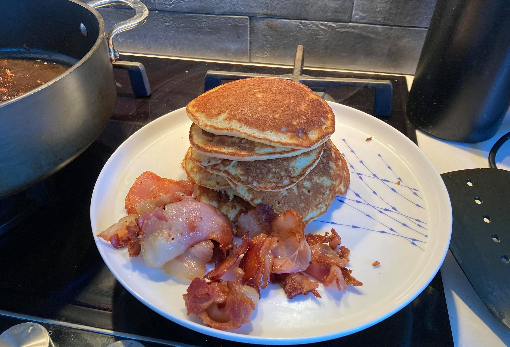
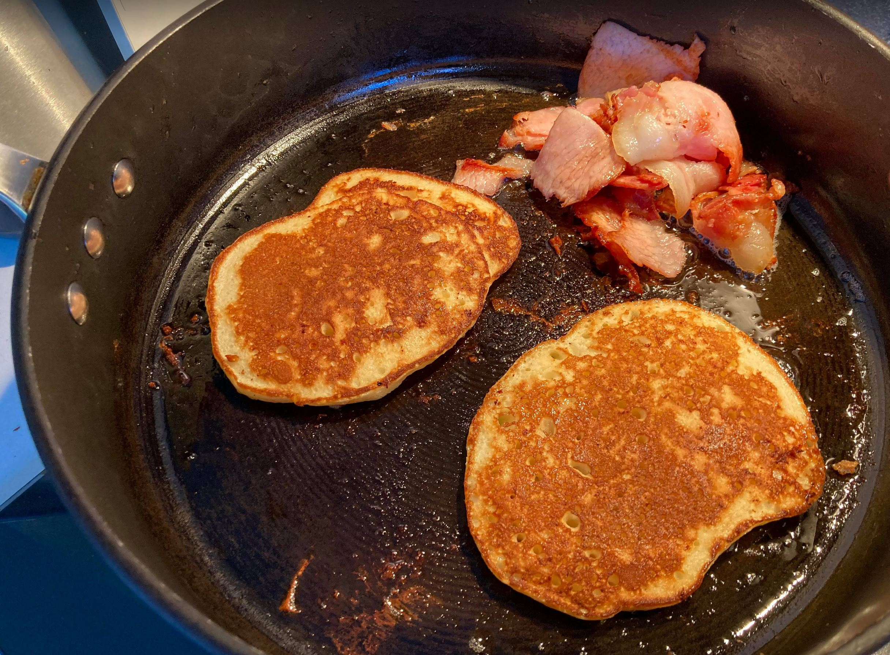

# Pancakes that are worth eating

Max deliciousness achieved by cooking in bacon fat.

Build the amount of flour and sugar around how much buttermilk you have. Achieve the desired consistency. Live with the quantity. 500ml buttermilk will spawn pancakes for four hungry savages.

## Details
Makes: many pancakes\
Prep Time:  10min\
Cook Time:  4min per batch

## Ingredients
- Flour (I like using half and half wholemeal and plain)
- Bicarb pinch (or just use self raising flour)
- Three eggs
- Caster sugar (less than you think)
- Buttermilk (approx 500ml, or just whatever)
- Old butter in the fridge for lubricating pan
- *optional*: bacon (even a tiny bit does wonders)

## Method
1. Get a large pan and put it on low heat. It is essential to reach equilibrium temp before you start cooking pancakes, so results are less volatile.
1. If you have bacon, get it in the pan now. Toss it from time to time to prevent it sticking.
1. Separate eggs into two different bowls.
1. Add all other ingredients (except butter) to the yolks, mix until smooth ish.
1. Whisk whites until stiff.
1. Fold whites into batter.
1. Use butter if the pan is not already lubricated with delicious pig fat.
1. Ladle batter into pancake like formations. Make sure they are not too tall.
1. I won't tell you when to flip them, you already know.
1. Repeat the butter step to here until you run out of batter.

