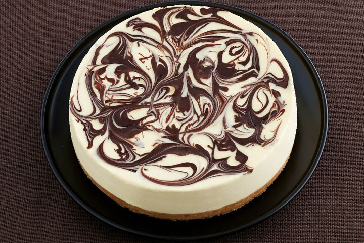

# White Chocolate Cheesecake

## Source
Taste [link](https://www.taste.com.au/recipes/no-bake-white-chocolate-cheesecake/1166491c-9b8c-4afc-8031-b1b628d796a9url)\

## Details
Serves: 16 \
Prep Time: 30 minutes\
Chill Time: 4 hours or overnight

## Ingredients
- 250g packet nice biscuits
- 125g butter, melted
- 6 gelatine leaves (or 3 teaspoons powdered gelatine)
- 2 x 180g blocks white chocolate, chopped
- 600ml tub thickened cream
- (optional) 180g dark chocolate, chopped. Alternatively top with fruit.
- 750g cream cheese, softened

## Method
1. Grease a 22cm round (base) springform pan. Line base and sides with 2 layers of baking paper, extending paper 2cm above edge of pan.
2. Process biscuits in a food processor until finely chopped. Add butter. Process until mixture is well combined. Press over base of prepared pan. Refrigerate until needed.
3. Place gelatine leaves in a small bowl of cold water. Stand for 5 to 7 minutes or until softened.
4. Meanwhile, place white chocolate in a microwave-safe bowl. Microwave on HIGH (100%), stirring with a metal spoon every 30 seconds, for 1 to 2 minutes or until smooth. Gradually add 1/2 the cream, stirring constantly, until mixture is well combined (see notes).
5. (Optional) Place dark chocolate in a microwave-safe bowl. Microwave on HIGH (100%) for 1 minute or until smooth.
6. Squeeze excess liquid from gelatine and place in a small saucepan over low heat. Cook, stirring constantly, for 30 seconds or until melted. Remove from heat.
7. Using an electric mixer, beat cream cheese until light and fluffy. Add coconut milk powder. Beat to combine. Add hot gelatine, beating until combined. Add white chocolate mixture. Beat to combine, scraping down sides of bowl. Beat in remaining cream until combined. Pour mixture into prepared pan. Level top.
8. (Optional) Working quickly, drizzle dark chocolate over top of cheesecake. Run a butter knife through mixture to create a marbled effect.
9. Refrigerate overnight or until cheesecake has set.