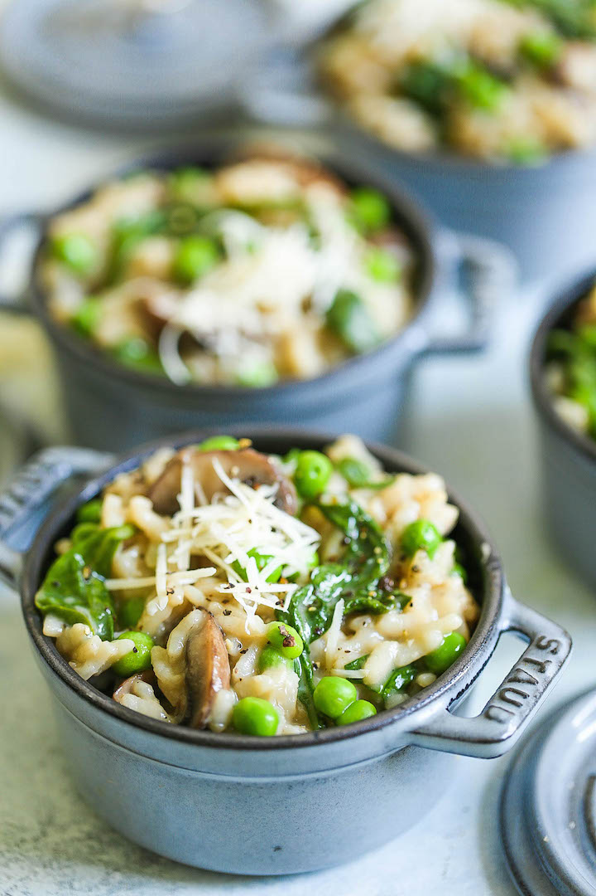

# Mushroom Risotto

## Source
Damn Delicious [link](https://damndelicious.net/2018/03/21/instant-pot-mushroom-risotto/)\

## Details
Serves: 6\
Prep Time: 10 minutes\
Cook Time: 20 minutes

## Ingredients
- 60g unsalted butter, divided
- 3 cloves garlic, minced
- 1 onion, diced
- 225g mushrooms thinly sliced
- Kosher salt and freshly ground black pepper, to taste
- 2 cups chicken stock
- 1 cup arborio rice
- 1/4 teaspoon dried thyme
- 2 cups baby spinach
- 3/4 cup frozen peas, thawed
- 1/4 cup freshly grated Parmesan

## Method
1. Saute onions. Melt 2 tablespoons butter; add garlic and onion, and cook, stirring often, until onions have become translucent, about 3-4 minutes.
2. Add mushrooms and cook, stirring occasionally, until tender, about 3-4 minutes; season with salt and pepper, to taste.
3. Stir in chicken stock, rice and thyme.
4. Pressure Cook on High for 6 minutes.
5. Quick Release.
6. Stir in spinach and remaining 2 tablespoons butter until the spinach has wilted, about 2 minutes. Stir in peas and Parmesan until heated through, about 30 seconds to 1 minute.
7. Serve immediately.