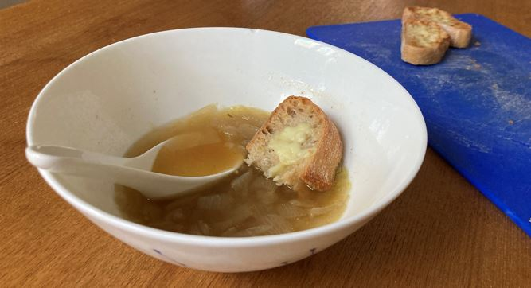

# French Onion Soup

## Details
Serves: 10\
Prep Time:  30 minutes\
Cook Time:  20 minutes

## Ingredients
- 1.5kg onions
- 50g butter
- 1/2 teaspoon bicarb
- 1/4 cup white wine (optional)
- 1 teaspoon dried thyme
- 12g minced garlic
- 1 tablespoon fish sauce
- 1 tablespoon soy sauce
- 1 bay leaf
- 1L beef stock
- 1L chicken stock
- baguette
- grated cheese (Gruyere if possible)

## Method
1. Slice all the onions (not dice).
1. Instant pot on saute (high). Melt butter.
1. Add onions to instant pot. Add bicarb immediately and stir.
1. Saute onions until liquid starts to come out.
1. Add all other ingredients except baguette and cheese.
1. Pressure cook for 20 mins.
1. Slice baguette and grill with cheese sprinkled on top.
1. Serve with baguette floating in the soup.
