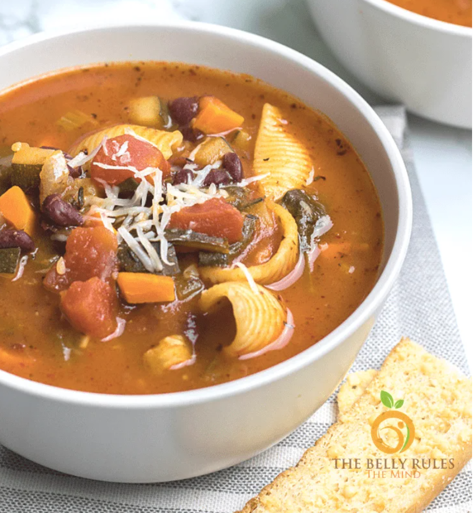

# Minestrone

## Source
The Belly Rules The Mind [link](https://thebellyrulesthemind.net/instant-pot-minestrone-soup/)\

## Details
Serves: 6\
Prep Time: 10 minutes\
Cook Time: 15 minutes

## Ingredients
- 2 tablespoons olive oil
- 1 cup onion finely chopped
- 1/2 cup carrots chopped
- 1/2 cup celery chopped
- 1 zucchini chopped
- 2 garlic cloves / minced
- 400g can petite diced tomatoes do not drain
- 400g can of kidney beans drained & rinsed
- 3 tablespoons tomato paste
- 7 cups low sodium vegetable broth
- 1 tbsp italian seasoning
- salt more or less to preference
- 1/2 teaspoons pepper
- 1.5 cup spinach leaves
- 1/2 cups shell pasta

## Method
1. Heat oil on 'sauté' high.
2. Add the onion and garlic in the instant pot and sauté until lightly caramelized about 3 minutes.
3. Add zucchini ,carrots ,celery, sauté 1 minute.
4. Add in the diced tomatoes and tomato paste.
5. Press the Keep Warm/Cancel button.
6. Add in the beans, vegetable broth , Italian seasoning , salt, Black pepper powder, Baby spinach and Pasta shells. Give it a nice stir .
6. Pressure cook for 6 minutes on High.
7. Quick release.
